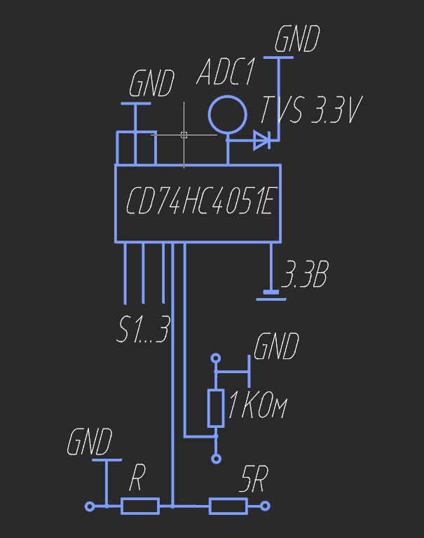
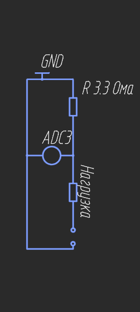
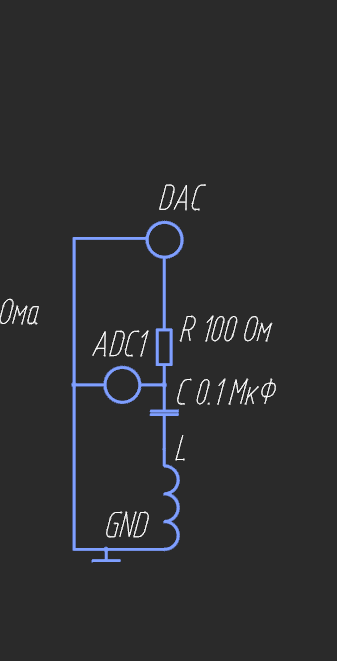

# STM32 Measurement Module — 5-в-1 измерительный модуль для ПК

Самодельный USB-измерительный модуль на **STM32F429**: вольтметр, амперметр,
осциллограф, генератор сигналов и LC-метр в одном устройстве.
Данные уходят на ПК по UART (92160 baud) собственным тегированным протоколом;

🎬 [Видео-демонстрация](https://www.youtube.com/watch?v=UyZ2to9oL0o&t=3s&pp=ygUKdXNiIDUt0LItMQ%3D%3D)

## Возможности

| Модуль | Диапазон | Примечания |
|---|---|---|
| Вольтметр | 0–3.3 В / 0–19.8 В | 2 диапазона, мультиплексор CD74HC4051, TVS-кламп 3.3 В |
| Амперметр | 0–1 А | шунт 3.3 Ом 5 Вт, low-side, целочисленная математика |
| Осциллограф | до 100 кГц дискретизация | ADC1 + DMA, буфер 500 отсчётов, децимация ×10 |
| Генератор | ~1 Гц – 62.5 кГц | DAC + TIM6 DMA; синус / меандр / треугольник / пила |
| LC-метр | 2.5–253 мГн | резонансный метод, эталонный C = 100 нФ |

Особенность: **LC-метр использует осциллограф и генератор как часть измерительного
контура**, поэтому при его включении они принудительно отключаются (взаимная
блокировка общих ресурсов TIM3/TIM6).

## Архитектура прошивки

Event-driven модель без RTOS:

- Прерывания и DMA взводят флаги событий в `statusFlag`
  (`FLAG_OS_READY`, `FLAG_UART_READY`, `FLAG_V_READY`, `FLAG_A_READY`);
- `main loop` читает и сбрасывает флаги, вызывая обработчики приборов;
- Состояния ВКЛ/ВЫКЛ модулей — биты `onFlag` с взаимными блокировками;
- Вся математика целочисленная там, где это возможно (никакого `stdio` и `float`
  в горячих путях, кроме формулы LC);
- LC-метр — машина состояний: смывной оборот DMA → накопление и усреднение →
  шаг частоты; двухпроходный поиск (грубый 500 Гц, точный 50 Гц).

### Метод LC-метра

Последовательный контур L–C с известным C обходится по частоте; на резонансе
реактивные сопротивления компенсируются и амплитуда на узле **проваливается** —
прибор ищет минимум, а не максимум:

```
f_res = 1 / (2π√(LC))   →   L [мГн] = 1000 / (4π² · f² · C)
```

## Схемы

### Вольтметр: входной мультиплексор и делитель


### Амперметр: low-side шунт


### LC-метр и вход осциллографа


### BOM аналоговой части

| Элемент | Номинал | Назначение |
|---|---|---|
| R шунта | 3.3 Ом, 5 Вт | датчик тока (1 А = 3.3 В = полная шкала) |
| R делителя | 5R + R (отношение 5:1) | диапазон 19.8 В |
| R защитный | 1 кОм | ограничение тока в кламп |
| R контурный | 100 Ом | делитель с LC-ветвью, формирует провал |
| C эталонный | 100 нФ | опора резонансного метода |
| U1 | CD74HC4051 | коммутатор диапазонов/каналов |
| D1 | TVS 3.3 В | защита входа АЦП |

## UART-протокол

Команды (строка + `\n`):

| Команда | Назначение |
|---|---|
| `V ON` / `V OFF` | вольтметр |
| `A ON` / `A OFF` | амперметр |
| `OS ON` / `OS OFF` | осциллограф |
| `GEN ON` / `GEN OFF` | генератор |
| `L ON` | запуск развёртки LC-метра (гасит OS и GEN) |
| `VRANGE <0\|1>` | диапазон вольтметра: 0 — напрямую, 1 — делитель 1:6 |
| `OSFREQ <Гц>` | дискретизация осциллографа |
| `GENFREQ <Гц>` | частота генератора |
| `SETWAVEFORM <0–3>` | 0 синус, 1 меандр, 2 треугольник, 3 пила |

Ответы — тегированные строки, один тег = один канал:

```
O 1650      ← точка осциллографа, мВ
V 1234      ← вольтметр, мВ
A 100       ← амперметр, мА
F 4500      ← LC: резонансная частота, Гц
L 13        ← LC: индуктивность, мГн
```

## Точность и известные ограничения

Честный бюджет погрешностей (макетный образец, номинальные компоненты):

- **Вольтметр 1:1** — ±1–2% (опора VDDA);
- **Вольтметр 1:6** — ~±4% без калибровки (допуск делителя), ~±0.5–1% после
  одноточечной калибровки;
- **Амперметр** — аддитивное смещение 50–60 мВ от монтажа (контакты макетки,
  общий возвратный провод), мультипликативная часть от номинала шунта;
  после одноточечной калибровки ±2–3%;
- **LC-метр** — ±2% (шаг развёртки) + допуск эталонного конденсатора (доминирует);
- Осциллограф ограничен 100 кГц дискретизации: выше 10 кГц сигнала остаётся
  <10 точек на период.

Калибровка сводится к правке одного коэффициента на диапазон (ошибки
мультипликативные) и автонолю (ошибки аддитивные).

## Лицензия

MIT 
